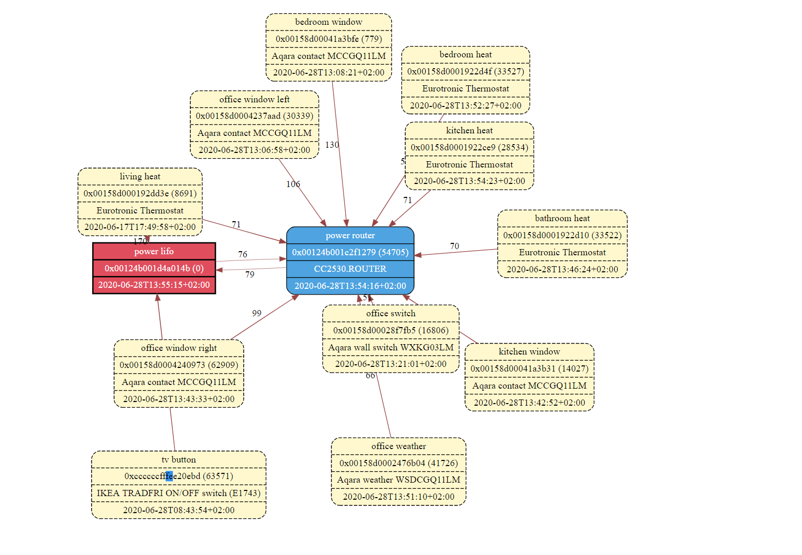

# Eutrotronic failing device config

  '0x00158d000192dd3e':
    friendly_name: living heat
    retain: true

## address
* 'living heat' (Eurotronic) failing device
  * 0x00158d000192dd3e / 00:15:8d:00:01:92:dd:3e
  * 0x21f3 = 8691

* coordinator : 'power lifo'
  * 0x00124b001d4a014b / 00:12:4b:00:1d:4a:01:4b
  * 0x0000
* router      : 'power router'
  * 0x00124b001c2f1279 / 00:12:4b:00:1c:2f:12:79
  * 0xd5b1 = 54705

* bathroom heat (Eurotronic) properly running device
  * 0x82f2= 33522


## error time 
2020-06-28 14:50:01

```
error 2020-06-28 14:50:01: Publish 'set' 'current_heating_setpoint' to 'living heat' failed: 'Error: Write 0x00158d000192dd3e/1 hvacThermostat({"16387":{"value":1100,"type":41}}, {"timeout":10000,"disableResponse":false,"disableDefaultResponse":true,"direction":0,"srcEndpoint":null,"reservedBits":0,"manufacturerCode":4151,"transactionSequenceNumber":null}) failed (Error: Data request failed with error: 'MAC transaction expired' (240))'

debug 2020-06-28 14:50:01: Error: Write 0x00158d000192dd3e/1 hvacThermostat({"16387":{"value":1100,"type":41}}, {"timeout":10000,"disableResponse":false,"disableDefaultResponse":true,"direction":0,"srcEndpoint":null,"reservedBits":0,"manufacturerCode":4151,"transactionSequenceNumber":null}) failed (Error: Data request failed with error: 'MAC transaction expired' (240))
    at Endpoint.<anonymous> (/opt/zigbee2mqtt/node_modules/zigbee-herdsman/dist/controller/model/endpoint.js:162:23)
    at Generator.throw (<anonymous>)
    at rejected (/opt/zigbee2mqtt/node_modules/zigbee-herdsman/dist/controller/model/endpoint.js:6:65)
```

# Network map
